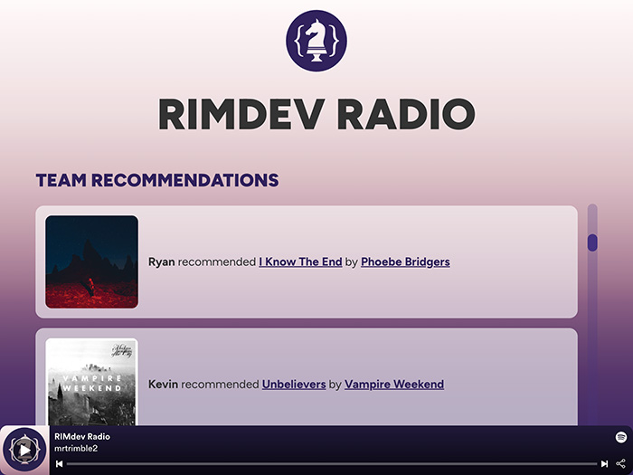

My current favorite thing in web dev is a new site generator called [Astro](https://astro.build/). 

Astro is like [Hugo](https://gohugo.io/) and [11ty](https://11ty.dev), yet contains a few neat tricks right out of the box. The main goal of Astro is to deliver as little JavaScript to the browser as possible. It handles this by running JavaScript in the build process or when rendered server-side. That is not to say you can't run JavaScript in the browser though. In fact, you can include components from any of the major JS frameworks, such as Vue, React, and Svelte. This is possible through a concept Astro is pioneering: [component islands](https://docs.astro.build/en/concepts/islands/).

I recently [delivered a talk](https://astro-friday-talk-slides.netlify.app/1) on Astro to our dev team as part of the "Friday Talks" we do here in RIMdev. I demonstrated how to build with Astro and it's server-side rendering capability. The [first demo](https://astro-friday-talk.netlify.app/) shows off it's framework agnostic abilities, and how to run JavaScript. The [second demo](http://astro-pokemon.netlify.app/) shows how you can run JavaScript server-side and deliver only HTML. These projects were fun to build, but I wanted to try and build something with a bit more substance.

## RIMdev Radio

Annual enrollment period is RitterIM's busiest part of the year and we have been doing a lot of prep-work for it. Music is near essential as there is a lot of manual testing performed. I traded song recommendations with a few folks on the Front End team and thought it might be fun to make a site out of it. [RIMdev Radio](https://rimdev-radio.netlify.app/) a place to display and listen to what music team members like the most. 



I built the site using a few different technologies:

- [Astro](https://astro.build/) - Site generator
- [Sass](https://sass-lang.com/) - CSS preprocessor
- [Vue](https://vuejs.org/) - JavaScript framework
- [Supabase](https://supabase.com/) - a cloud PostgreSQL database
- [Spotify API](https://developer.spotify.com/) - Searching and playlist management
- [Netlify](https://www.netlify.com/) - Server-side rendering/hosting

The idea was that team members would be able to search Spotify for songs and update the playlist. Recommendations get stored in a database table, which would then display on the home page. The idea didn't quite pan out due to limitations of the Spotify API, but still able to deliver with a slight pivot.

In Spotify, you can set up collaborative playlists that allows you and friends to add songs to a playlist. This function is not available to the API though, as spammers could overrun playlists. I learned this at the finish line, so while I can update the playlist through the API - no one else can. Unfortunate as this was the main feature of the app. 

That's OK though! Team members that choose to take part can send me songs they would like included and I can update the playlist. This was a super fun weekend project and I was able to learn a lot, so no harm done!

## Piecing it all together

### Astro

Everything happens inside Astro and luckily getting started is quite easy!

The `npm create astro@latest` command walks you through the process of setting up a new instance. I choose the default options for everything, except opting out of using TypeScript. 

From there, the new site will scaffold and there are few organizational things to take note of:
- The **Pages** directory is where each site page will live. These will use the `.astro` file extension, and are capable of running JavaScript at build.  So you can generate HTML code by running certain JavaScript functionality.
- The **Components** directory will house UI components. These can be Astro components or components for whichever framework you prefer.
- The **Layouts** directory is where you can include components used for layout purposes.

As I intended to use Sass for styling, I also added a `styles` folder to the `src` directory.

Speaking of which, to setup Sass - you do need to install Sass as a dependency to use it:

```
npm install -d sass
```

From there, your Sass file gets imported into your main `Layout.astro` file like:

```js
---
import '../styles/styles.scss';
---
```

As Astro uses [Vite](https://vitejs.dev/) under the hood, Sass will get compiled and included as a linked asset in the HTML.

I also wanted to be able to use Vue as a component framework. Astro provides easy-to-use integrations, so adding Vue to the project was a matter of running:

```
npx astro add vue
```

This automically installs the Vue package and includes it in the `astro.config.mjs` file.

### Supabase

I found myself liking the combination of Supabase and Astro's server-side rendering. Supabase is a cloud database service, like Google's [Firebase](https://firebase.google.com/), but runs on PostgreSQL. For a project like this, it worked out nice!

To use Supabase, create an account and a new database. Then you can install the package with:

```
npm install @supabase/supabase-js
```

I created a `.env` file in the root of the project and added my Supabase key:

```
SUPABASE_KEY={YOUR SUPABASE KEY}
```

Supabase also provides a database URL, which can also be in the `.env` file. I did not, instead I added it direct in JavaScript.

Inside `pages/index.astro`, you can import `createClient` from the Supabase package. You can also grab the `.env` variables and apply them as constants.

```js
---
import Layout from '../layouts/Layout.astro';
import { createClient } from '@supabase/supabase-js';

const supabaseUrl = {YOUR SUPABASE URL}
const supabaseKey = import.meta.env.SUPABASE_KEY
---
```

Now we can query the database and retrieve data from tables! For example, if we wanted to select all the rows of a table called `recommendations`:

```js
let { data: recommendations, error } = await supabase
  .from('recommendations')
  .select();
```

This query will run on page build (or on server-side render) and store it in the `recommendations` array. From there, we can use `recommendations` inside the template with normal JavaScript array methods.

```js
<ul> 
{ 
  recommendations
    .sort((a, b) => a.id - b.id)
    .reverse()
    .map((rec) => <Recommendation recommendation={rec} />) 
}
</ul>
```

You can also insert data into the database using Supabase methods. I created a form within a Vue component and a method to submit items to the database. Inserting data to Supabase looks like:

```js
await supabase
  .from("recommendations")
  .insert([
    {
      name: 'Ryan',
      song: 'Moon Song' 
    }
  ]);
```

Definitely one of the simplest ways to use a database that I've come across!

### Spotify API

The Spotify API is available to anyone who has a premium plan with Spotify. 

Registering a new app will provide you with a client ID and client secret codes. Store these in your `.env` file:

```
SPOTIFY_CLIENT_ID={YOUR CLIENT ID}
SPOTIFY_CLIENT_SECRET={YOUR CLIENT SECRET}
```

To use the Spotify API, it is necessary to be able to authenticate users with Spotify in some way. 

Spotify provides several methods to do so. As I intended on using server-side rendering, I could use the [Client Credential Flow](https://developer.spotify.com/documentation/general/guides/authorization/client-credentials/). This method allows users to authenticate with Spotify, retrieve an OAuth code, which the app can then trade for an access token. Access tokens will be used to make API calls. 

I set up Astro pages to handle the authentication routing:

- `pages/auth/login.astro` - This is the page that initiates the authentication process with Spotify. Users will be redirected to the Spotify login page.
- `pages/auth/callback.astro` - Callback is the page where users will be directed after logging into Spotify. There will be an OAuth token added as a URL search parameter that can be retrieved and used for the next step. I stored this temporarily in the browser's local storage.
- `pages/auth/token.astro` - The Token page is where we pass the OAuth token back to Spotify to retrieve an access token. Here the access token is stored as a cookie with an one hour expiration. Spotify access tokens only last one hour. After successfully retrieving an access token, the user is redirected back to the home page.

Within each of those pages, I included a corresponding Vue component to handle the client side JavaScript part of the authentication process.

Once the authentication is out of the way, users can then use their access token to perform API calls such as searching the Spotify library.

```js
const handleSearch = () => {
  const endpoint = new URL("https://api.spotify.com/v1/search");
  endpoint.searchParams.append("query", search.value);
  endpoint.searchParams.append("type", "track");
  endpoint.searchParams.append("market", "US");
  if (access_token.value) searchSpotifyApi(endpoint.href);
};

const searchSpotifyApi = async (url) => {
  options.value = [];
  return await fetch(url, {
    method: "GET",
    headers: {
      Authorization: `Bearer ${access_token.value}`,
    },
  })
    .then((response) => response.json())
    .then((data) => {
      options.value = [...data.tracks.items];
    })
    .catch((err) => console.log(err));
};
```

I set up a separate API call which adds items to a playlist, but as previously mentioned, does *not* allow users to update playlists they do not own.

### Netlify

Netlify is a great service for deploying static sites. Like Amazon Web Service's product Lambda, Netlify also provides the capability of running cloud functions. Astro can be built in a way to leverage this feature, enabling server-side rendering. This may sound complicated at first, but it is almost *too* easy as Astro provides an integration to help set this up.

```
npx astro add netlify
```

Running the add Netlify integration command will automatically install necessary packages and update the `astro.config.mjs` file.

Now all that is needed is to deploy the site to Netlify. I typically do this by connecting Netlify to the GitHub repo, which gives the added benefit of automatically re-deploying the site when pushing to the main branch. You can also use PR Previews to see changes to the site before a pull request is even merged to the main branch.

## Final Thoughts

Overall working with Astro is a super enjoyable experience. I'm looking forward to building more projects with it!

I'd like to give a special shout out to my friend [Mac](https://twitter.com/MaciejPedzich) for help navigating the Spotify API.

You can find the full code available on the [RIMdev Radio repo](https://github.com/mrtrimble/rimdev-radio) on Github.